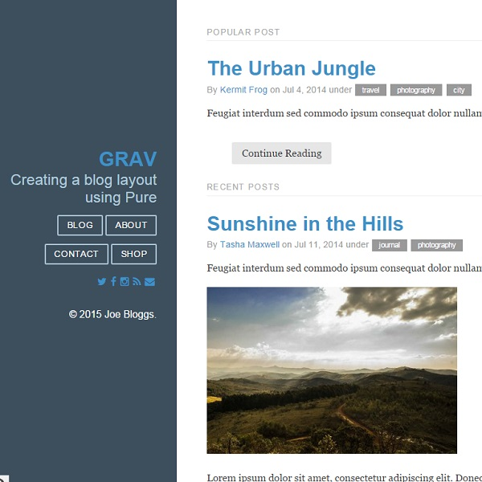

# Purity Theme for Grav

Purity: [Pure CSS](http://www.purecss.io) from [Yahoo](http://www.yahoo.com) into Grav, with customised options for menu design & control

* HTML5 and CSS3
* Fully Responsive
* Optimised for current browser technology - nothing below IE8
* Various templates for presenting your content
* Microdata for blogs
* Google Fonts weighting & balance
* ARIA accessibility conformance
* Calendar with actual date (post date for blog items)
* Styling for all basic page elements
* Styling for various modules
* Cross browser compatible
* Custom dynamic avatars, tagline and footer.
* Sharing buttons for Facebook and Twitter with share count.

# Installation

Installing the Purity theme can be done in one of two ways. Our GPM (Grav Package Manager) installation method enables you to quickly and easily install the theme with a simple terminal command, while the manual method enables you to do so via a zip file.

The theme by itself is useful, but you may have an easier time getting up and running by installing a skeleton. A skeleton is being developed in due course.

## Dynamic avatars

Dynamic avatar images for each author must be placed inside the `/your/site/grav/user/themes/purity/images` directory as JPG. Each avatar image should be a lowercase version of the author. i.e. Fred Bloggs becomes fred-bloggs.jpg

## Dynamic tagline

The tagline can be changed by changing the 'tagline' text when inside the Purity theme configuration area of the Admin or inside the purity.yaml file.

## Dynamic footer

The footer can be turned on and off when inside the Purity theme configuration area of the Admin or inside the purity.yaml file.

## Alternate layouts

Alternate layout and menu styling is being developed based on the core layouts designed by Yahoo. Currently the '[blog](http://purecss.io/layouts/blog/)' layout works, with the 'marketing' - combined [marketing](http://purecss.io/layouts/marketing/) & [pricing](http://purecss.io/layouts/pricing/) table layouts -  and '[email](http://purecss.io/layouts/email/)' designs coming soon. Menu options & contrast colour styling will be offered closer to 1.0.0 release.

# Customising core CSS

Purity runs a combination of Grunt & Gulp to build the latest bleeding edge edition of Yahoo's [Pure CSS](http://www.purecss.io). The process is fairly simple. Once Node, Gulp & Grunt have been installed inside /your/site/grav/user/themes/purity, run:

	grunt
	gulp

This will build a brand new pure.min.css file inside /your/site/grav/user/themes/purity/css

## GPM Installation (Preferred)

The simplest way to install this theme is via the [Grav Package Manager (GPM)](http://learn.getgrav.org/advanced/grav-gpm) through your system's Terminal (also called the command line).  From the root of your Grav install type:

    bin/gpm install purity

This will install the Purity theme into your `/user/themes` directory within Grav. Its files can be found under `/your/site/grav/user/themes/purity`.

## Manual Installation

To install this theme, just download the zip version of this repository and unzip it under `/your/site/grav/user/themes`. Then, rename the folder to `purity`. You can find these files either on [GitHub](https://github.com/absalomedia/grav-theme-purity) or via [GetGrav.org](http://getgrav.org/downloads/themes).

You should now have all the theme files under

    /your/site/grav/user/themes/purity

>> NOTE: This theme is a modular component for Grav which requires the [Grav](http://github.com/getgrav/grav), [Error](https://github.com/getgrav/grav-plugin-error) and [Problems](https://github.com/getgrav/grav-plugin-problems) plugins.

# Updating

As development for the Purity theme continues, new versions may become available that add additional features and functionality, improve compatibility with newer Grav releases, and generally provide a better user experience. Updating Purity is easy, and can be done through Grav's GPM system, as well as manually.

## GPM Update (Preferred)

The simplest way to update this theme is via the [Grav Package Manager (GPM)](http://learn.getgrav.org/advanced/grav-gpm). You can do this with this by navigating to the root directory of your Grav install using your system's Terminal (also called command line) and typing the following:

    bin/gpm update purity

This command will check your Grav install to see if your Purity theme is due for an update. If a newer release is found, you will be asked whether or not you wish to update. To continue, type `y` and hit enter. The theme will automatically update and clear Grav's cache.

## Manual Update

Manually updating Purity is pretty simple. Here is what you will need to do to get this done:

* Delete the `your/site/user/themes/purity` directory.
* Download the new version of the Purity theme from either [GitHub](https://github.com/absalomedia/grav-theme-purity) or [GetGrav.org](http://getgrav.org/downloads/themes).
* Unzip the zip file in `your/site/user/themes` and rename the resulting folder to `purity`.
* Clear the Grav cache. The simplest way to do this is by going to the root Grav directory in terminal and typing `bin/grav clear-cache`.

> Note: Any changes you have made to any of the files listed under this directory will also be removed and replaced by the new set. Any files located elsewhere (for example a YAML settings file placed in `user/config/themes`) will remain intact.

# Setup

If you want to set Purity as the default theme, you can do so by following these steps:

* Navigate to `/your/site/grav/user/config`.
* Open the **system.yaml** file.
* Change the `theme:` setting to `theme: purity`.
* Save your changes.
* Clear the Grav cache. The simplest way to do this is by going to the root Grav directory in Terminal and typing `bin/grav clear-cache`.

Once this is done, you should be able to see the new theme on the frontend. Keep in mind any customizations made to the previous theme will not be reflected as all of the theme and templating information is now being pulled from the **purity** folder.

# Contact Form Configuration
For contact form configuration instructions please refer to [official documentation](http://learn.getgrav.org/forms/forms/example-form). Make sure you installed Email and Form plugin though.
